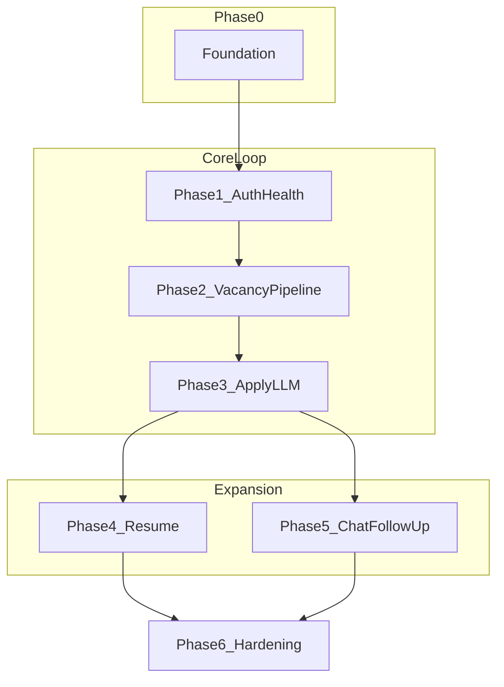
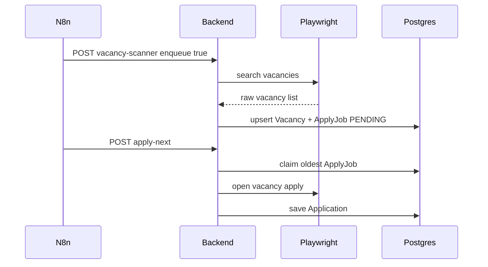

# Поэтапный план реализации HH Automation

Источник истины для разработки. В новых чатах агент должен следовать этому документу и [ARCHITECTURE.md](../ARCHITECTURE.md).

Краткий чеклист прогресса: [ROADMAP.md](../ROADMAP.md).

## Зафиксированные решения

- Оркестрация только в **n8n**; бизнес-логика в **NestJS**; браузер только в **Playwright**
- Очередь Apply: **Postgres `ApplyJob`** + n8n **`apply-next`** (без Redis/BullMQ)
- Auth hh.ru: **Playwright session** (`storageState`), без официального HH API на старте
- LLM: OpenAI-compatible adapter, structured JSON, low temperature

## Порядок фаз

| Фаза | Блокирует | Можно параллелить |
|------|-----------|-------------------|
| 0 | всё | — |
| 1 | 2–5 (нужна сессия) | docs / notify stub |
| 2 | 3 | черновик Prisma моделей Phase 4/5 |
| 3 | ценность продукта | — |
| 4 и 5 | — | друг друга после Phase 3 |
| 6 | — | точечно с Phase 3+ |

---

## Phase 0 — Закрытие foundation

**Цель:** локальный стенд поднимается без сюрпризов.

- Скопировать `.env.example` → `.env` и `apps/backend/.env` (`DATABASE_URL` под Compose)
- `docker compose up -d` (Postgres, n8n; backend/playwright as needed)
- `prisma migrate dev --name init` (модель `WorkflowRun` в `apps/backend/prisma/schema.prisma`)
- Проверить: `GET /api/health`, stub `POST /api/workflows/*`, smoke Playwright

**Done when:** health зелёный при живой БД; n8n UI открывается.

---

## Phase 1 — Auth и Health

**Цель:** система видит, залогинен ли пользователь, и алертит при поломке.

| Слой | Работа |
|------|--------|
| Playwright | Модуль `actions/auth`: login / restore `storageState` / проверка сессии; скриншоты на ошибке |
| Backend | Use cases: `GetAuthStatus`, расширенный `GetHealth` (api + db + playwright + session); репозиторий сессии/конфига |
| n8n | Workflow Health Check каждые 30 мин → backend → Error Workflow (stub notify) |

**Доменная модель (минимум):** `AuthSession` (status, checkedAt, expiresAt?, storagePath).

**Done when:** health отражает `session: up|down`; при down n8n уходит в error path.

---

## Phase 2 — Vacancy pipeline

**Цель:** находить вакансии, дедуплицировать, класть в очередь на отклик. Apply ещё без LLM.

| Слой | Работа |
|------|--------|
| Prisma | `Vacancy`, `Application`, `ApplyJob` (status: PENDING/RUNNING/DONE/FAILED), unique `externalId` |
| Backend | `ScanVacanciesUseCase`, `ApplyNextUseCase`, `ApplyToVacancyUseCase` |
| Playwright | `actions/vacancies`: search, open, read card fields (без решений) |
| n8n | Cron Vacancy Scanner (раз в сутки); cron Apply → `apply-next` |

**Идемпотентность:** upsert по `hhVacancyId`; повторный apply того же id не дублирует отклик; claim `PENDING→RUNNING` атомарный.

**Done when:** повторный scanner не плодит дубликаты; очередь наполняется; apply stub пишет результат в БД.

---

## Phase 3 — Applications и cover letters

**Цель:** реальный цикл «анализ → письмо → задержка → отклик».

| Слой | Работа |
|------|--------|
| Backend | LLM port + adapter; `AnalyzeVacancyUseCase`; `GenerateCoverLetterUseCase`; delay policy (random human-like) |
| Playwright | `apply` action: заполнить/отправить отклик; читать результат UI |
| Prisma | статусы Application: APPLIED / FAILED / NEEDS_MANUAL; хранить letter + analysis JSON |
| n8n | retries на apply; correlationId в payload |

**Done when:** dry-run и/или ограниченный live apply сохраняет письмо и статус; без LLM-схемы apply падает контролируемо.

---

## Phase 4 — Resume maintenance

**Цель:** поднятие резюме и редкая оптимизация под рынок.

1. **Resume Maintainer** (каждый час): Playwright `raise resume` если доступно; лог в `ResumeAction`
2. **Resume Optimizer** (раз в 3 дня): агрегация tech из свежих `Vacancy` → LLM diff → Playwright update **двух** резюме

**Done when:** maintainer идемпотентен в пределах часа; optimizer пишет changelog и откатываемый снимок полей.

---

## Phase 5 — Messaging

**Цель:** отвечать работодателям и делать follow-up без спама.

1. **Chat Processor** (каждые N минут): читать диалоги → классификация (template / AI Q&A / rejection / interview) → ответ или notify
2. **Follow-up Worker** (раз в день): если нет ответа работодателя — reminder #1–#3 max

**Модели:** `ChatThread`, `ChatMessage`, `FollowUpState` (reminderCount ≤ 3).

**Done when:** rejection помечается processed без ответа; interview уходит в notify; follow-up не шлёт 4-е напоминание.

---

## Phase 6 — Hardening

**Цель:** устойчивость к банам, наблюдаемость, прод.

- Глобальный pacing / rate limits / working-hours gate в backend
- Метрики (успешные apply, errors, session age); алерты
- `DRY_RUN=true` — полный пайплайн без клика «Откликнуться»
- Runbook деплоя (Compose/prod), бэкапы БД, ротация session

**Done when:** dry-run проходит E2E; есть чеклист инцидентов (session expired, captcha, queue stuck).

---

## Принципы на всех фазах

- Тонкие контроллеры; Prisma только в repositories (`.cursor/rules/02-backend.mdc`)
- Playwright без бизнес-решений (`.cursor/rules/03-playwright.mdc`)
- Один n8n workflow = один процесс (`.cursor/rules/04-n8n.mdc`)
- После каждой фазы: обновить чекбоксы в `ROADMAP.md`; review по `.cursor/rules/07-code-review.mdc`
- Не прыгать через фазы: feature-логику вакансий не начинать, пока Phase 1 не принят

## Текущий фокус

1. ~~Закрыть **Phase 0** (env + migrate + compose)~~
2. ~~**Phase 1** (auth session + deep health)~~
3. ~~**Phase 2** — Vacancy pipeline~~
4. ~~**Phase 3** — LLM + cover letters + real apply~~
5. ~~**Phase 4** — Resume maintenance~~
6. ~~**Phase 5** — Messaging (chat + follow-up)~~
7. ~~**Phase 6** — Hardening~~
